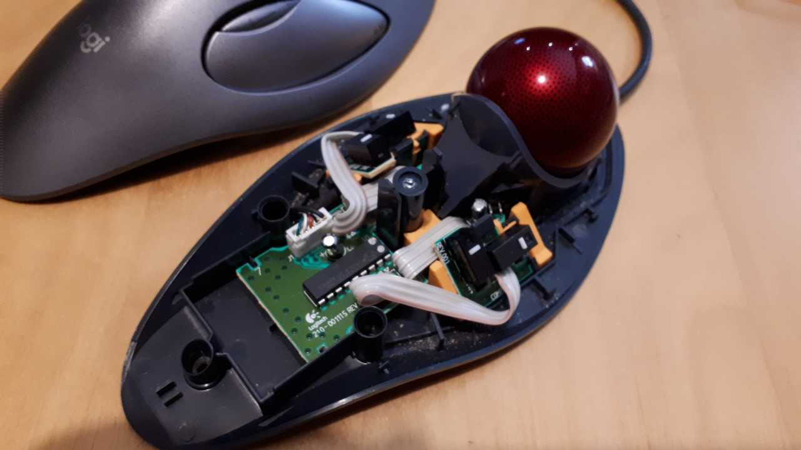

This repository contains my references for repairing the discontinued Logitech Trackball (I only experienced with the 4-button version).

The main failure point for these trackball is the buttons, becoming unreliable, either not clicking or always double/triple clicking. 

I got inspired from two contributions:
 * This youtube video detailing how to change the mouse microswitches: [https://www.youtube.com/watch?v=oGf5q5bjra0]
 * These designs and instructions to reinforce the mouse internal structure: [https://www.thingiverse.com/thing:3416522] (Note, there are also upgraded instructions for the 2-button version here: [https://www.thingiverse.com/thing:4754168]). I followed the instruction there to prepare the mouse and I printed the two simple parts that are inserted around the center screw to increase the rigidity.

The proposed design is required at a much later stage than what I did for my mouse: they require removing the internal support structure of the button PCB and replacing it completely with a 
printed model.

In my case, the internal structure holding the PCB was still sound but it became a bit soft, making the PCB wiggle and reducing the reliability of the button. The design here keeps the internal structure
and fits snuggly around it, supporting and rigidifying the PCB. 

After implementing on my two mice, I identified that one switch was reliably double-clicking. I replaced it following the instructions in the video and the mouse is good to go. 

Once the mouse is open, the button pcb detached from the plastic holders, and two parts printed, here are the steps:
1) clip the model around the cable on the side where you want to route it:

2) insert the part and the cable below the PCB (the larger "foot" towards the ball):

3) insert the second part on the other side.

4) reclip the PCBs: they need to be inserted vertically and then tilted into place. This should result in a rigid structure without forcing. In my case, I had to snip the pins of the switches below the pcb. 

5) possibly insert the rigidifying blocks at the center (seen in the picture here, design at [https://www.thingiverse.com/thing:3416522]), reroute the cable, reassemble plastic casing, and you can test the buttons. If some of them are still double clicking, you're probably good for changing the corresponding switch.  
